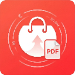

# AliExpress Order Exporter 📦🚀

**AliExpress Order Exporter** is a robust Chrome Extension designed to simplify the process of exporting your purchase history. It extracts essential order data, fetches original English product titles, and provides direct links to official tax receipts.



## ✨ Key Features

* **Anti-Bot Friendly:** Operates within your active browser session, eliminating "Unusual Traffic" errors and login hurdles.
* **English Title Fetching:** Automatically crawls product pages in the background to retrieve original English titles, bypassing auto-translated or localized names.
* **Smart Date Formatting:** Converts localized date strings (e.g., German `24. Mär 2026`) into a standardized numerical format (`24.03.2026`).
* **Direct Receipt (Beleg) Links:** Generates direct URLs to the `tax-ui` invoice page for every order, making PDF saving much faster.
* **Batch Invoice PDF Download:** Downloads the official invoice for every selected order as a PDF and bundles them into a single ZIP file — no need to open and print each one by hand.
* **CSV Export:** One-click export to a clean CSV file, fully compatible with Microsoft Excel and Google Sheets.
* **Serialized Indexing:** Automatically numbers your orders in a clean, organized table view.

## 🛠 Installation Guide

1.  **Download** or clone this project folder to your computer.
2.  Open **Google Chrome** and go to `chrome://extensions/`.
3.  Turn on **Developer mode** using the toggle in the top-right corner.
4.  Click the **Load unpacked** button.
5.  Select the folder where you saved the extension files.

## 🚀 Usage Instructions

1.  Log in to your [AliExpress Account](https://www.aliexpress.com).
2.  Navigate to your **Orders** page: `https://www.aliexpress.com/p/order/index.html`.
3.  Click the **AliExpress Order Master** icon from your Chrome toolbar (pin it for easy access).
4.  Click the **Extract Data** button.
5.  Wait for the table to populate (it fetches titles in the background).
6.  Click **Download Excel (CSV)** to save your records locally.
7.  To save the official receipts, (un)check the orders you want and click **Download Invoices (PDF)**. Prefer running this from the **Open Full Page** tab rather than the small popup, since closing the popup mid-run stops the process. The invoice page is a client-rendered app, so the extension opens each one in a hidden tab, waits for it to render, and prints it to PDF via Chrome's debugger API — you'll briefly see a "started debugging this browser" banner while this runs. All the resulting PDFs are bundled into a single `Downloads/AliExpress_Invoices_<date>.zip`.

## 📦 Building the Extension

Build scripts package the extension source files (see `EXTENSION_FILES` in `scripts/build.js`) into a distributable `.zip` and/or signed `.crx`, output to `dist/`.

```bash
npm install        # install devDependencies (archiver, crx)

npm run build:zip  # dist/aliexpress-order-exporter-v<version>.zip
npm run build:crx  # dist/aliexpress-order-exporter-v<version>.crx (signed with key.pem)
npm run build      # builds both zip and crx
```

The `.crx` build signs the package with `key.pem`, generating one on first run if it doesn't exist yet. Keep that file (it's git-ignored) so the extension ID stays the same across future `crx` builds — do not commit it.